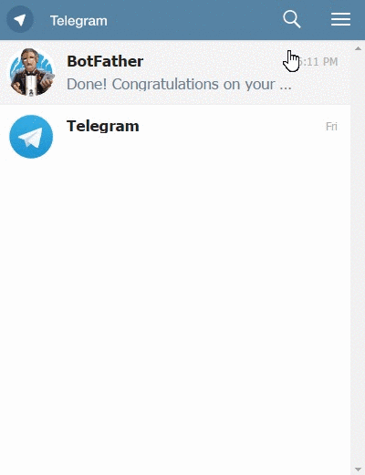
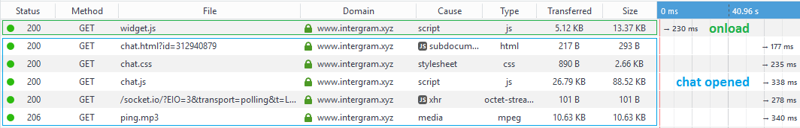

# Cloud Chat - [Demo](https://livecloudchat.herokuapp.com/)

Kwaiichan: Modifikasi & Penerjemah Intergram
Sebuah widget obrolan langsung **Gratis** yang dapat Anda tambahkan dengan mudah ke situs web Anda. Ini akan memungkinkan Anda mengobrol dengan pengunjung situs web Anda menggunakan utusan Telegram Anda.

#### :tada: Kontributor Utama :tada:
- [aslauris](https://github.com/aslauris) - Siapa yang membuat UI pertama! Lihat situs webnya - [wedofe.com](https://www.wedofe.com/)

#### :tada: Pembaruan dan Penerjemah :tada:
- [aslauris](https://github.com/Cloud-IT-code) - Siapa yang mengubah UI baru dan penerjemah! Lihat situs webnya - [cloudcenter-cc](https://cloudcenter-cc.blogspot.com/)


##### Bagaimana?
Anda memulai obrolan dengan bot Telegram saya dan menambahkan 2 baris skrip ke situs web Anda untuk menyematkan widget. Pesan pengunjung dikirim dari widget obrolan ke server bot saya, yang mengirimkannya ke messenger Telegram Anda di mana Anda dapat menjawabnya. Anda juga dapat menghosting server bot sendiri untuk mendapatkan kontrol lebih besar atas proses ini.

##### Mengapa menggunakan bot Telegram untuk menerapkan widget obrolan?
Dengan menggunakan bot Telegram, saya mendelegasikan semua pekerjaan perutean pesan dan manajemen status obrolan ke Telegram. Saya tidak perlu membuat aplikasi seluler dan desktop yang mewah untuk beberapa platform karena Telegram sudah memiliki klien obrolan multiplatform yang hebat. Dan, saya dapat dengan mudah menangani beban dalam jumlah besar, karena aplikasi saya berjalan sepenuhnya tanpa kewarganegaraan (Tanpa basis data) dan hanya berfungsi sebagai pipa antara Telegram dan pengguna widget obrolan.

### Sematkan Cloud Chat di situs web Anda dengan 2 langkah sederhana ini

1. Buka [Telegram messenger](https://web.telegram.org/), cari `@livecloudchat` dan klik `/start` untuk mendapatkan Chat ID unik Anda. ([direct link](https://web.telegram.org/#/im?p=@livecloudchatbot))

  <p align="center">  </p>

2. Tempel cuplikan kode ini tepat sebelum tag body penutup pada setiap halaman tempat Anda ingin chat muncul
(Jangan lupa untuk menambahkan ID obrolan Anda yang sebenarnya). 

```html
<script> window.cloudchatId = "Chat ID unik Anda" </script>
<script id="cloudchat" type="text/javascript" src="https://livecloudchat.herokuapp.com/js/widget.js"></script>
```

*Catatan: membalas pesan tertentu harus digunakan untuk menanggapi pengunjung tertentu. Mengirim pesan standar akan disiarkan ke semua klien obrolan yang terhubung (Anda mungkin merasa lebih mudah menggunakannya jika Anda hanya memiliki satu percakapan aktif)*

**Pemberitahuan Penting:** Saya berencana untuk menjaga layanan obrolan yang dihosting 100% gratis (juga tidak ada iklan!), Tetapi ada beberapa biaya hosting (server, domain, cdn, dll), jadi saya akan segera mulai memaketkan [Loadmill](https://www.loadmill.com) komponen dengan skrip Cloud Chat. Loadmill adalah konsep baru dan masih dalam Beta - **Jika Anda merasa tidak nyaman dengan ini, gunakan versi yang dihosting sendiri.**

### Kustomisasi - [Cobalah](https://jsfiddle.net/z9ffzr9n/6/)
Saat ini Anda dapat menyesuaikan semua teks yang terlihat dan warna widget utama dengan mengatur opsional `cloudchatCustomizations` objek di tag skrip injeksi. (Semua propertinya juga opsional dan akan dikembalikan ke nilai aslinya)
```html
<script> 
    window.cloudchatId = "Chat ID unik Anda";
    window.cloudchatCustomizations = {
        titleClosed: 'Judul obrolan tertutup',
        titleOpen: 'Judul obrolan terbuka',
        introMessage: 'Pesan pertama saat pengguna membuka chat untuk pertama kalinya',
        autoResponse: 'Pesan yang dikirim segera setelah pengguna mengirim pesan pertamanya',
        autoNoResponse: 'Pesan yang dikirim satu menit setelah pengguna mengirim pesan pertamanya ' +
                        'dan tidak ada tanggapan yang diterima',
        mainColor: "#E91E63", // Bisa berupa warna yang didukung css 'red', 'rgb(255,87,34)', etc
        alwaysUseFloatingButton: false // Gunakan juga tombol mengambang seluler di layar besar
    };
</script>
<script id="cloudchat" type="text/javascript" src="https://livecloudchat.herokuapp.com/js/widget.js"></script>
```

<p align="center">  </p>

### Footprint Awal
  - Menggunakan [Preact](https://github.com/developit/preact) membantu membuat bundel `js` yang cukup minimal.
  - Skrip injeksi widget berukuran sekitar 5 KB di-gzip dan hanya dijalankan setelah halaman host selesai memuat (event 'onload').
  - Iframe obrolan hanya akan dimuat jika pengguna berinteraksi dengan widget obrolan (saat ini dalam format gzip sekitar 40KB).
  


### Terapkan instans Cloud Chat Anda sendiri (Hosting Sendiri)
1. Bicaralah dengan Telegram [@BotFather](https://telegram.me/botfather), buat bot baru dan dapatkan Token API-nya.

2. Terapkan repo ini ke server obrolan Anda sendiri.
  - Klon secara lokal dan instal atau jika Anda menggunakan Heroku, buat garpu repositori ini dan arahkan aplikasi baru ke sana.
  - Tetapkan variabel .env bernama `TELEGRAM_TOKEN` dengan nilai yang Anda dapatkan dari @BotFather

3. Arahkan bot webhook ke server bot Anda dengan membuat permintaan `GET` ke url berikut
  `https://api.telegram.org/bot<TOKEN>/setWebhook?url=<Server url>/hook`
  (Jangan lupa untuk mengganti token dan url server Anda)

4. Buka obrolan dengan bot Anda dan tekan `/start` untuk mendapatkan chat ID unik Anda

5. Sematkan cuplikan kode ini di situs web Anda
  ```html
  <script> 
      window.cloudchatId = "Chat ID unik Anda"
      window.cloudchatServer = "Server url"
  </script>
  <script id="cloudchat" type="text/javascript" src="<Server url>/js/widget.js"></script>
  ```
6. :tada:
